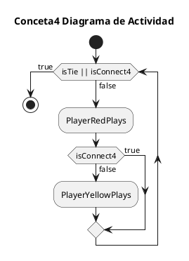

```plantuml
@startuml

title Conceta4 Diagrama de Actividad

start
while (isTie || isConnect4) is (false)
  :PlayerRedPlays;
  if (isConnect4) then (true)
  else (false)
    :PlayerYellowPlays;
  endif
endwhile (true)
stop

@enduml
```