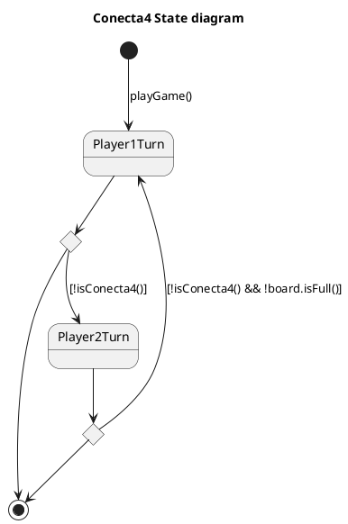

```plantuml
@startuml

title Conecta4 State diagram

state Player1Turn
state Player1Win <<choice>>

state Player2Turn
state Player2Win <<choice>>

[*] --> Player1Turn : playGame()

Player1Turn --> Player1Win
Player2Turn --> Player2Win

Player1Win --> Player2Turn : [!isConecta4()]
Player2Win --> Player1Turn : [!isConecta4() && !board.isFull()]

Player1Win --> [*]
Player2Win --> [*]

@enduml
```