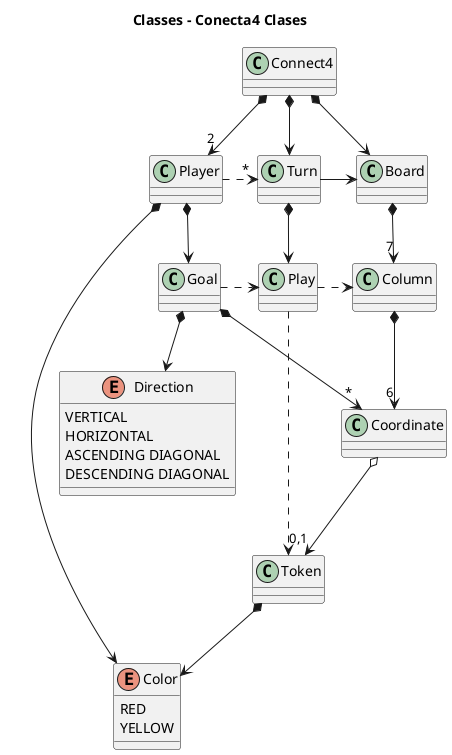

```plantuml
@startuml

title Classes - Conecta4 Clases

class Connect4
class Player
class Turn
class Board
class Coordinate
class Column
class Goal
class Token
class Play

enum Color {
    RED
    YELLOW
}

enum Direction {
    VERTICAL
    HORIZONTAL
    ASCENDING DIAGONAL
    DESCENDING DIAGONAL
}

Connect4 *-down->"2" Player
Connect4 *-down-> Turn
Connect4 *-down-> Board

Player .right.>"*" Turn
Turn -right->Board

Board *-down->"7" Column
Column *-down->"6" Coordinate

Player *-down-> Goal
Turn *-down-> Play

Goal .right.> Play

Token *-down-> Color
Coordinate o-down->"0,1" Token
Play .down.> Token
Play .right.> Column

Player *-down-> Color
Goal *-right->"*" Coordinate

Goal *-down-> Direction

@enduml
```